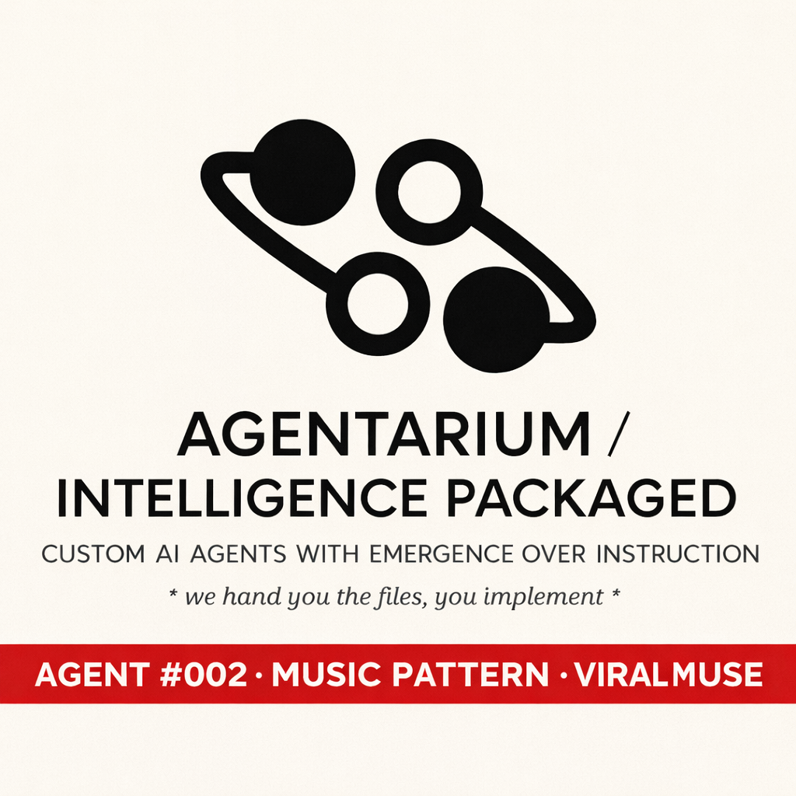

  

Viral Muse – Music Pattern Agent

A dataset-driven creative agent for music concept development: hooks, song structures, TikTok-native concepts, genre transformations, and viral-signal auditing.

This is not a finetuned model with weights. It’s an Agentarium-style agent package (system prompt + reasoning + personality + guardrails) bundled with RAG datasets + a lightweight knowledge graph (atoms/edges/knowledge map) so builders can plug it into their own runtime (n8n, LangChain, Flowise, Dify, custom app).

---

What it does

Hook generation (concept-first): multiple hook angles with replay triggers

Song structure blueprinting: verse/pre/chorus/bridge plans + escalation rules

TikTok concept patterns: openers, filming format, loop mechanics, cut points

Genre transformations: keep the “core payload” while changing genre skin

Viral signal audit: clarity, novelty, tension, comment-bait, replay value

Creative partner advice: testable edits + A/B variants + what to watch in metrics

---

What’s inside

Core agent components

core/system_prompt.md

core/reasoning_template.md

core/personality_fingerprint.md

guardrails/guardrails.md

Datasets (RAG)

datasets/lyric_structure_map.csv

datasets/viral_pattern_signals.csv

datasets/genre_transformation_rules.csv

datasets/tiktok_concept_patterns.csv

datasets/viral_potential_rated.csv

datasets/creative_partner_advice_map.csv

Knowledge graph (optional but included)

datasets/knowledge_map.csv

datasets/atoms_master.csv

datasets/edges_master.csv

Docs + memory

docs/product_readme.md

docs/use_cases.md

docs/workflow_notes.md

memory_schemas/user_profile_memory.csv

memory_schemas/project_workspace_memory.csv

memory_schemas/memory_rules.md

Manifest

meta/agent_manifest.json

---

Quick start (RAG runtime)

1) Load the agent prompt stack (in this order)

1. core/system_prompt.md (system message)

2. guardrails/guardrails.md

3. core/reasoning_template.md (developer/hidden rules)

4. core/personality_fingerprint.md (style constraints)

2) Upsert datasets to your Vector DB

Convert each CSV row into a clean “retrieval document” and embed it.
Recommended metadata per vector:

dataset (which CSV it came from)

row_id (or primary key)

optional tags (genre, pattern_type, etc.)

3) At runtime

Classify intent (hook / structure / TikTok / genre flip / audit)

Retrieve top-K rows from the relevant dataset(s)

Synthesize an output that is structured, testable, and compact

If something isn’t in retrieved context, say unknown (don’t invent dataset facts)

See docs/workflow_notes.md for a step-by-step n8n-style implementation.

---

Example prompts

“Give me 10 hook angles for bittersweet confidence — modern pop. Add replay triggers.”

“Design a 30s TikTok loop concept: 1 angle, 1 prop, bedroom performance.”

“Transform this concept into cumbia, then alt-rock. Keep the emotional payload.”

“Audit this chorus for viral signals. Give minimal fixes, not a full rewrite.”

---

Guardrails (important)

No imitation or reproduction of copyrighted lyrics/melodies.

No “copy this artist/song” outputs.

No hallucinated dataset claims: stay grounded in retrieved rows.

Outputs should be structured (variants, constraints, test plan).

---

License

Set your preferred license in LICENSE and in meta/agent_manifest.json.

---

Credits

Created by Agentarium (Frank / FlowMancer).
Package standard: Agentarium v1.Viral Muse – Music Pattern Agent

A dataset-driven creative agent for music concept development: hooks, song structures, TikTok-native concepts, genre transformations, and viral-signal auditing.

This is not a finetuned model with weights. It’s an Agentarium-style agent package (system prompt + reasoning + personality + guardrails) bundled with RAG datasets + a lightweight knowledge graph (atoms/edges/knowledge map) so builders can plug it into their own runtime (n8n, LangChain, Flowise, Dify, custom app).

---

What it does

Hook generation (concept-first): multiple hook angles with replay triggers

Song structure blueprinting: verse/pre/chorus/bridge plans + escalation rules

TikTok concept patterns: openers, filming format, loop mechanics, cut points

Genre transformations: keep the “core payload” while changing genre skin

Viral signal audit: clarity, novelty, tension, comment-bait, replay value

Creative partner advice: testable edits + A/B variants + what to watch in metrics

---

What’s inside

Core agent components

core/system_prompt.md

core/reasoning_template.md

core/personality_fingerprint.md

guardrails/guardrails.md

Datasets (RAG)

datasets/lyric_structure_map.csv

datasets/viral_pattern_signals.csv

datasets/genre_transformation_rules.csv

datasets/tiktok_concept_patterns.csv

datasets/viral_potential_rated.csv

datasets/creative_partner_advice_map.csv

Knowledge graph (optional but included)

datasets/knowledge_map.csv

datasets/atoms_master.csv

datasets/edges_master.csv

Docs + memory

docs/product_readme.md

docs/use_cases.md

docs/workflow_notes.md

memory_schemas/user_profile_memory.csv

memory_schemas/project_workspace_memory.csv

memory_schemas/memory_rules.md

Manifest

meta/agent_manifest.json

---

Quick start (RAG runtime)

1) Load the agent prompt stack (in this order)

1. core/system_prompt.md (system message)

2. guardrails/guardrails.md

3. core/reasoning_template.md (developer/hidden rules)

4. core/personality_fingerprint.md (style constraints)

2) Upsert datasets to your Vector DB

Convert each CSV row into a clean “retrieval document” and embed it.
Recommended metadata per vector:

dataset (which CSV it came from)

row_id (or primary key)

optional tags (genre, pattern_type, etc.)

3) At runtime

Classify intent (hook / structure / TikTok / genre flip / audit)

Retrieve top-K rows from the relevant dataset(s)

Synthesize an output that is structured, testable, and compact

If something isn’t in retrieved context, say unknown (don’t invent dataset facts)

See docs/workflow_notes.md for a step-by-step n8n-style implementation.

---

Example prompts

“Give me 10 hook angles for bittersweet confidence — modern pop. Add replay triggers.”

“Design a 30s TikTok loop concept: 1 angle, 1 prop, bedroom performance.”

“Transform this concept into cumbia, then alt-rock. Keep the emotional payload.”

“Audit this chorus for viral signals. Give minimal fixes, not a full rewrite.”

---

Guardrails (important)

No imitation or reproduction of copyrighted lyrics/melodies.

No “copy this artist/song” outputs.

No hallucinated dataset claims: stay grounded in retrieved rows.

Outputs should be structured (variants, constraints, test plan).

---

License

Set your preferred license in LICENSE and in meta/agent_manifest.json.

---

Credits

Created by Agentarium (Frank Brsrk ).
Package standard: Agentarium 
email: agentariumfrankbrsrk@gmail.com 
X: @frank_brsrk 
Reddit: @frank_brsrk 
Substack : @frankbrsrk 
